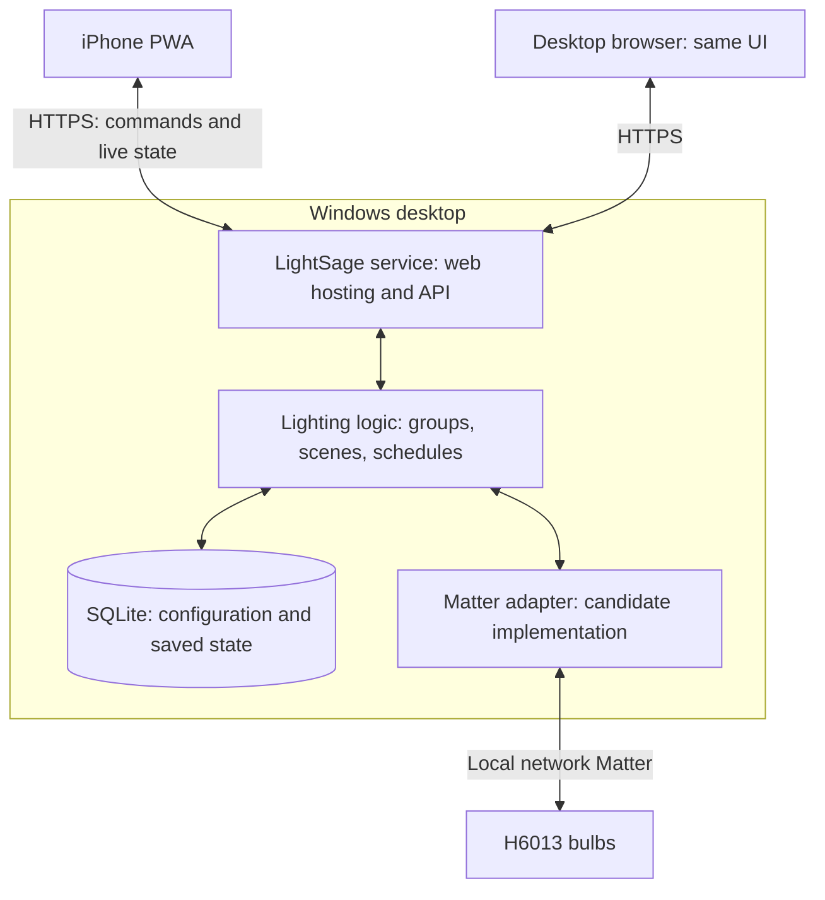

# LightSage architecture

Status: working one-bulb local prototype with browser controls and verified Full
White restoration across controller restart. iPhone installation, outage behavior,
and production service remain to be tested/implemented.

## Goals

- Manage approximately 20 Govee H6013 bulbs from an iPhone Home Screen web app.
- Develop and run on Windows without a Mac or Apple developer account.
- Use the existing always-on desktop as the lighting controller.
- Local-only operation is mandatory: no cloud APIs, cloud login, cloud relay,
  hosted frontend, telemetry, or runtime internet dependency. Pairing must also
  have a verified local path. No Govee API key is needed or requested.
- Allow UI and UX to evolve independently of device communication.
- Preserve the README's Full White toggle requirement; its exact white temperature,
  groups remain to be implemented. User confirmed a second tap restores the previous
  state; provisional Full White is 100% brightness at 4000 K. First bulb is Dining R.

## System shape



The Windows companion is primarily a background service. A tray application can
later provide service status, setup, and an Open LightSage button. The same web UI
works on desktop; a separate native desktop interface is unnecessary initially.

## Control protocol: validate first

Govee's published supported-product list does not currently include H6013.
Do not assume the public cloud API or Govee's separate LAN protocol supports it.
Govee advertises Matter for the B6013 pack; confirm the actual bulbs' pairing codes
and hardware before selecting the production adapter.

Preferred candidate: local Matter control using matter.js in the Windows service.
The project provides a TypeScript Matter controller implementation. This is a
candidate, not a claim that H6013 commissioning on this Windows machine is proven.

The first technical milestone must establish:

1. A supported way to commission one bulb into LightSage's Matter controller.
   Existing Wi-Fi enrollment alone does not establish Matter ownership. An already
   commissioned device may need a new sharing code and an open commissioning window.
   Fresh BLE commissioning on Windows is a separate compatibility question.
2. Power, brightness, color temperature, and color capabilities actually exposed.
3. State subscriptions, external changes, power-cycle recovery, and service restart.
4. Local control with the internet disconnected but the home network operational.

Do not make the Govee app or cloud a prerequisite for LightSage setup. Verify a
local commissioning path, including the case where bulbs already have Wi-Fi
credentials. Firmware updates and vendor-specific effects are outside the initial
scope. Existing bulb cloud traffic is a separate device/network concern: LightSage
must work with internet access blocked, but cannot claim to disable vendor traffic
merely by using Matter.

## Proposed implementation

| Component | Choice | Purpose |
| --- | --- | --- |
| PWA | React, TypeScript, Vite | Flexible UI, manifest, cached application shell |
| Windows service | Node.js LTS, TypeScript | Host UI/API and run lighting logic |
| API | HTTP commands plus server-sent events | Simple writes and live state updates |
| Storage | SQLite | Devices, groups, scenes, schedules, preferences |
| Device integration | Adapter interface, initially Matter candidate | Isolate protocol details from product logic |
| Deployment | Windows service with automatic restart | Run independently of browser and user login |

Use one repository, one deployed service, and one database. Proposed source layout:

```text
apps/web/                 PWA and desktop web UI
apps/service/             API, scheduler, persistence, Windows lifecycle
packages/domain/          Lighting types and behavior
packages/contracts/       API schemas and validation
packages/devices/         Adapter interface, simulator, Matter implementation
```

The first functional prototype lives in `tools/matter-probe`: Node HTTP/HTTPS
hosting, plain browser UI, local JSON settings, and the real Matter adapter. This
validates integration before committing the product UI to a framework. No Windows
service has been installed; the development server must remain running.

### Initial local discovery result

User confirmed all bulbs are enrolled in Govee Home using Bluetooth and/or 2.4 GHz
Wi-Fi; exact transport and Matter enrollment are not known. Do not infer Matter
commissioning from Govee enrollment.

Next hardware step: locate one bulb's Matter code, then try a single ordinary power
cycle and repeat discovery within Govee's documented 15-minute first-pairing window.
This is a discovery experiment, not a guarantee that Govee-enrolled bulbs will
advertise over IP. Govee's general FAQ warns that Wi-Fi enrollment order can affect
Matter; do not reset existing bulbs without first establishing a working local
commissioning method and deliberately choosing a test bulb.

On September 19, 2026, the Windows Wi-Fi interface successfully opened IPv4 and IPv6
mDNS sockets. A 20-second commissioning discovery scan found zero pairable devices.
This is not a compatibility verdict: bulb pairing mode, firewall/multicast reachability,
and current Matter enrollment remain to be checked. No bulbs were paired or changed.
Installed Node.js is 25.2.1; use a supported LTS release for the deployed service.

The diagnostic uses only the library's mDNS scanner. The upstream interactive shell
also includes online certificate/firmware functionality and must not be used as the
production service. Offline attestation trust data must be addressed before pairing
is claimed to be fully local.

## State and command behavior

- The service owns durable configuration and device observations. The phone is a client.
- Record desired state separately from reported state, including observation time,
  availability, and pending/failed commands. Never present a stale value as confirmed.
- Model device capabilities explicitly; show only controls the device supports.
- Commands set an explicit target state. Resolve toggle behavior on the service,
  so retries do not accidentally reverse an action.
- Group commands report per-bulb outcomes. Twenty bulbs are not an atomic transaction;
  use bounded concurrency, timeouts, and limited retries.
- Coalesce rapid slider changes and discard superseded commands.
- Schedules run on Windows, including when the PWA is closed. Define timezone,
  daylight-saving behavior, and missed-run policy when scheduling is implemented.
- When disconnected, the PWA can show cached UI and clearly stale observations.
  Do not queue lighting commands for unexpected execution much later.
- Implement Full White as a domain operation after defining restore and overlap rules.

## Network, HTTPS, and access

Host the PWA and API on the same HTTPS origin. The phone talks only to LightSage;
the Windows process handles Matter discovery and device communication.

Initial scope: home-network access. Remote access is deferred and must not introduce
a cloud dependency if requested later.

Use a stable local hostname and locally issued HTTPS certificate trusted by iOS.
Initial setup includes installing and trusting the local certificate authority on
the iPhone. Serve all scripts, icons, and fonts locally. Name resolution, certificate
issuance, and renewal must work without internet access.

Use authenticated sessions, secure HttpOnly cookies, and request-origin/CSRF checks.
Keep controller credentials on Windows, protect local storage, and back up Matter
controller identity as well as SQLite. Database-only backups may not preserve pairing.
Do not expose the service through router port forwarding by default.

Check Windows firewall, local IPv6, multicast discovery, and Wi-Fi client isolation
during the device proof of concept. Prefer native Windows networking for that test;
introduce VM/container networking only if there is a concrete reason.

## Delivery sequence

1. Confirm Matter codes and current enrollment; check Windows local discovery.
2. Prove one real bulb works from Windows and survives a service restart.
3. Build the service/API and a minimal PWA with a simulator for repeatable development.
4. Verify trusted HTTPS and Home Screen use on the actual iPhone.
5. Add inventory, groups, basic controls, and Full White behavior as UX is specified.
6. Validate all bulbs, partial failures, desktop reboot recovery, and backups.
7. Add scenes, scheduling, and optional tray UI as required.

## Successful discovery follow-up

After the user confirmed a Matter QR code exists and power-cycled a bulb, a
30-second scan outside the execution sandbox discovered two commissionable Matter
devices. Both advertise vendor 4999, product 24595 (0x6013), and commissioning mode 1.
Their local IPv4 addresses were 10.0.0.175 and 10.0.0.26. IPv6 addresses were also
advertised. Pairing and light control have not yet been tested.

The sandboxed scan immediately before this returned zero devices. Consequently,
the earlier zero-result scans must not be treated as evidence of bulb or network
incompatibility. Perform further hardware discovery with authorized local-network
access outside that sandbox. Next input needed is the selected bulb's Matter setup
code; do not commit pairing codes to this document or source control.

## Successful local pairing

On September 19, 2026, the selected bulb successfully paired over the existing home
network with the Windows proof-of-concept controller. It reports product H6013,
endpoint 1, and power, level, hue/saturation, XY color, and color-temperature support.
Fresh reads after restarting the controller succeeded (power on, level 254).
No Bluetooth setup, Wi-Fi credential change, factory reset, Govee API, or cloud
service was used by the pairing script. Actual light-changing commands and an
internet-disconnected end-to-end test are still pending.

Controller identity is stored under `tools/matter-probe/.state` and excluded from
source control. Preserve this directory: it contains the keys for the new pairing.
The pairing code is read from stdin and is not embedded in source files.

The prototype does not register the online DCL or OTA services and rejects HTTP
fetch attempts. It performs the library's local attestation checks and rejects
error-level findings, but currently lacks manufacturer root trust-chain and
certification-declaration signer verification. An offline trust store is required
before treating commissioning as production-ready. The diagnostic deliberately
disables subscriptions; persistent service subscriptions remain to be implemented.

## Browser control milestone

Dining R successfully accepted a brightness change from level 254 to 180 and back.
Full White was verified at level 254, color mode 2, and 250 mireds (4000 K). The
controller was restarted while the override was active; its saved snapshot survived
and the original active white state, level, and power were restored and read back.
The same Full White/Restore interaction was then verified through the browser UI.
The user also verified Full White and restore in Chrome after changing the bulb's
color. Background polling now leaves controls enabled and ignores stale read
responses when a newer command has started, avoiding the five-second button flash.

The local web prototype provides authenticated commands, explicit target states,
serialized hardware access, fresh state reads, offline-shell caching, and disabled
controls when state cannot be confirmed. It polls while visible as an interim step;
the proposed production service will use subscriptions and pushed state updates.

Desktop HTTP binds only to loopback on 3442. LAN control uses locally issued HTTPS
on 3443; port 3444 serves only public certificate setup instructions. The phone must
install/trust the local CA. With explicit user approval, the firewall rule
`LightSage-Local-Prototype` was installed and verified: inbound TCP 3443/3444,
local address 10.0.0.250, remote LocalSubnet, interface Wi-Fi. Windows still labels
Wi-Fi Public; no network profile was changed. The setup page returned HTTP 200 and
authenticated HTTPS checks passed from the PC. Real iPhone installation remains
unverified.

## Dining Room group milestone

User verified iPhone local access, then requested Dining Room. Node 2 was paired
locally and named Dining L; existing node 1 remains Dining R. Both reconnected
after their shared switch was power-cycled. Settings migrated to version 2 with
an untouched v1 backup, durable per-bulb names, group membership, restore snapshots,
and override ownership.

The browser target selector exposes the group and both bulbs. Group Full White
reads every original state before changing any member. Overlapping individual/group
overrides are rejected, repeated activation preserves snapshots, and partial
restore failures retain only the outstanding snapshots. State and command results
are reported per member. Operations are serialized; this prototype still polls.

Hardware validation used the existing different brightness levels (18 and 254),
confirmed both bulbs at Full White, restarted the controller, and restored each
original power, level, and active color with readback. Simulated tests verify abort
before any mutation if a snapshot read fails, partial restoration, persistence,
and retry. UI and HTTPS API expose the two-bulb group.

## Persistent browser sessions

Replaced in-memory sign-ins with seven-day HMAC-signed cookies backed by the existing
local controller secret. Cookie protections and request-origin checks remain intact.
Validated expiry, tampering, wrong keys, and malformed tokens, and verified that an
HTTPS session issued before a real server restart could read both bulbs afterward
without another login. Existing prototype sessions need one new sign-in.

## Sources

Session policy updated at the user's request: no application-level expiration.
V2 tokens contain no deadline. Correctly signed v1 sessions remain valid and upgrade
on use, avoiding another login. Cookies have a browser-compatible 400-day maximum
age renewed on authenticated requests; browser data deletion/eviction can still
require login. Verified legacy-session upgrade through a real service restart.

- [Govee supported API models](https://developer.govee.com/docs/support-product-model)
- [Govee B6013 product specifications and Matter support](https://us.govee.com/products/color-changing-light-bulb)
- [Govee Matter pairing FAQ](https://us.govee.com/pages/matter-faq)
- [matter.js controller implementation](https://github.com/matter-js/matter.js)
- [WebKit Home Screen web apps](https://webkit.org/blog/13878/web-push-for-web-apps-on-ios-and-ipados/)

Sources reviewed September 2026. Hardware verification is recorded above.
